# Campaign Scheduler

It allows users to create campaigns like flowcharts using dialog options such as **Action**, **Trigger**, **Rule**, and **End**.

## Features

## 1. Actions

They are used for various actions such as Send E-mail and SMS, Send E-mail, Send SMS, and Delete (to delete a node from the campaign).

### Sub-Features of Actions

a). **Send E-mail and SMS**: This Action is used to create two nodes in the campaign flow, one for sending E-mail and the other for sending SMS.

- **Send E-mail** (via Twilio or Pardot)
- **Send SMS** (via Quiq or Twilio)

b). **Send E-mail**: This Action is used to create only Send E-mail Nodes using which users can only send E-mails. Here, users have two options to choose from.

- **Send By Pardot**
- **Send By Twilio**

c). **Send SMS**: his Action is used to create only Send SMS Nodes using which the user can only send SMS. Further, users have two more options:

- **Send By Twilio**
- **Send By Quiq**

d). **Delete**: This Action is used to Remove a particular node from the campaign Tree if not required.

### Snapshots for Actions

:::tip snapshots
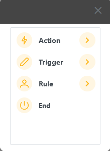 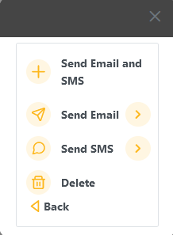  
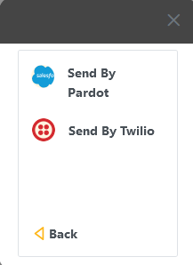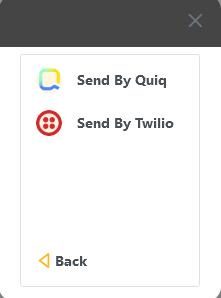
:::

## 2. Triggers

They are used to check for an event that might have happened in the customer journey in the campaign, eg. if the user has opened an email or whether the email has been delivered.

### Sub-Features of Triggers

a). **Email Open**: This Trigger checks whether an email has been opened by the user or not.
b). **Email Delivered**: This Trigger Checks whether an email has been delivered to the user or not.

### Snapshots for Triggers

:::tip snapshots
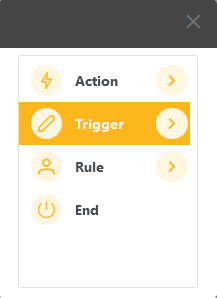 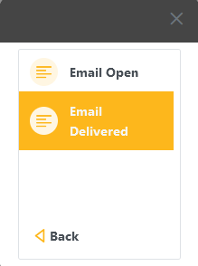
:::

## 3. Rules

They are used to execute a particular branch or sub-flow of the campaign based on some condition when they are satisfied.

### Sub-Features of Rules

a). **Wait**:Here, the user is supposed to choose from Option or type in
for how much duration they want to wait until the condition is satisfied.

### Snapshots for Rules

:::tip Snapshots
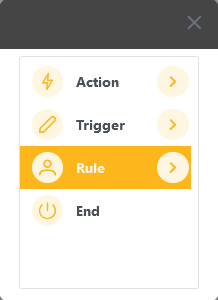 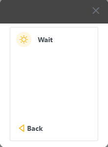  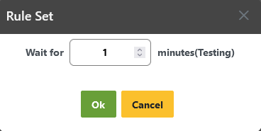
:::

## 4. End

It is used to insert an End Node, denoting the End of the Campaign.  
:::tip snapshot
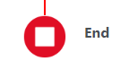
:::

## Customer Journey Count

Here, users also can view the whole customer journey how many customers are engaged in the present campaign and how many of them have crossed how many levels of the journey in each step of any campaign that has run or is running.

### Snapshots for Customer Journey

:::tip Image 1
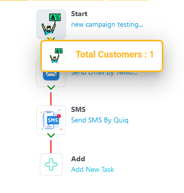
:::

## Select/Preview Email Templates

- In this section, if a user wants to send an E-mail via Twilio, then a dialog will ask the user to choose E-mail Templates from the available ones
- Here, the user can also see the Thumbnail of a particular E-mail Template.
- Also, if a User wants to Preview the Template design, then a preview button along-side will let the user preview the template, before selecting it.

### Snapshots for E-mail Template Selection

:::tip Image 1  
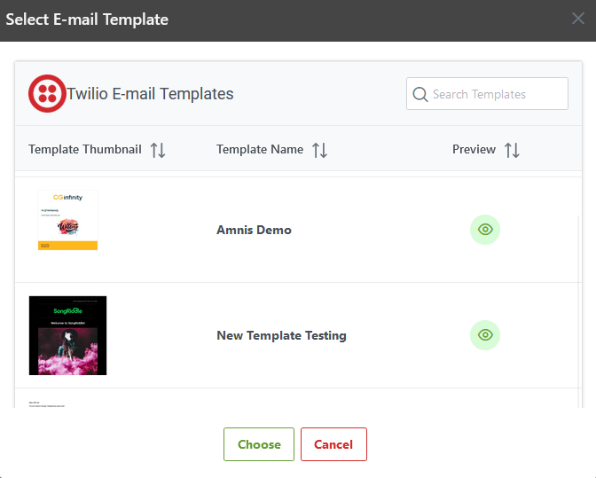
:::

:::tip Image 2

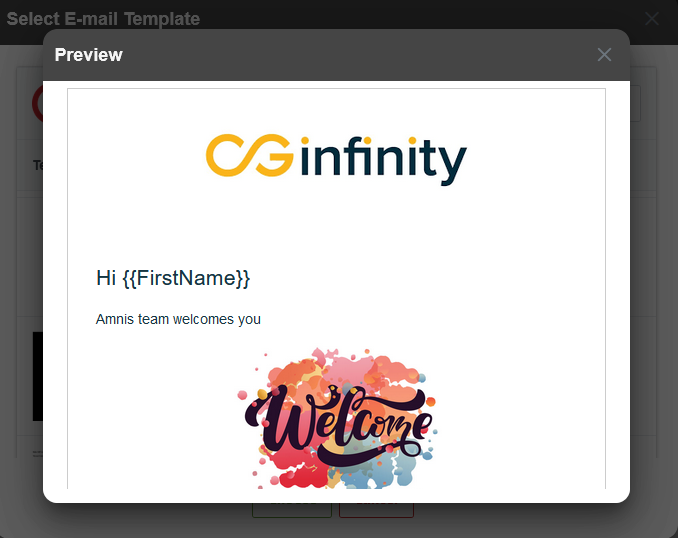
:::

## Select/Preview SMS templates

- This feature allows users to choose SMS templates for Twilio or Quiq.
- It also allows users to preview the SMS Templates before the final selection.

### Snapshots for SMS Template Selection

:::tip -

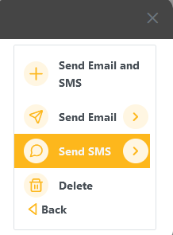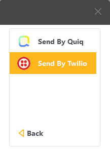  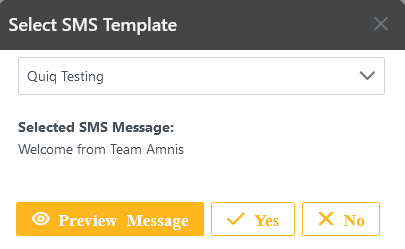
:::

## Snapshots for Campaign Creation

:::tip Image 1

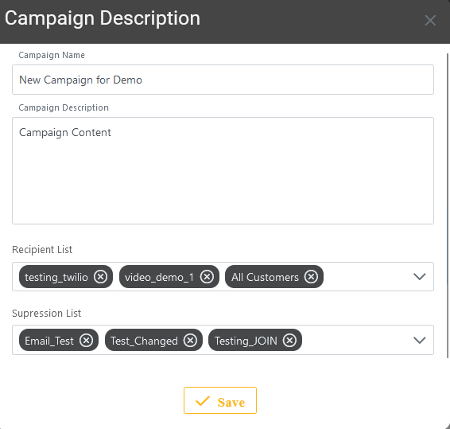
:::
:::tip Image 2

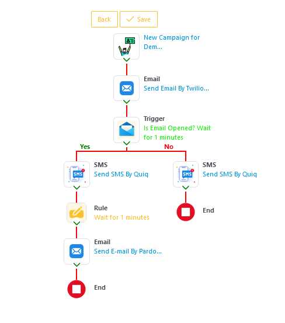
:::
