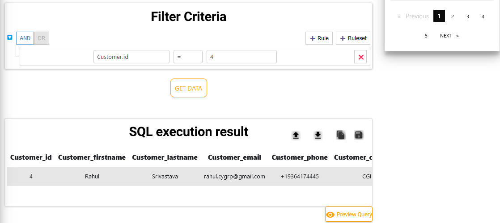
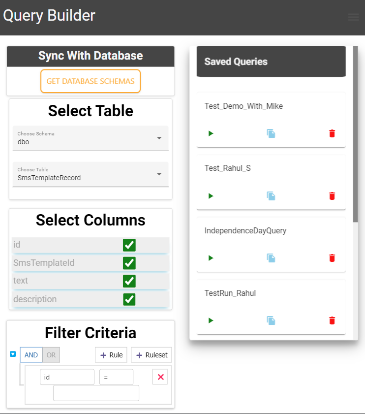
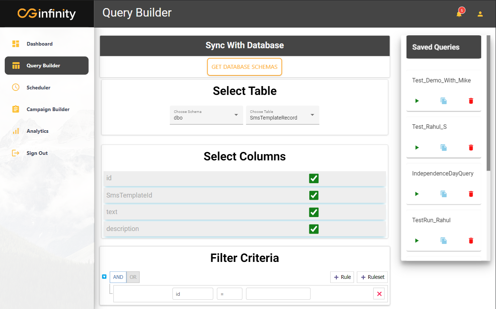

# Query Builder

<!-- Add **Markdown or React** files to `src/pages` to create a **standalone page**: -->

The **Query Builder** is used to Generate different queries to get the desired list so that they can be further used while creating campaigns to schedule them.

Here, you can filter the list of users for campaigns and make queries as per required.

## Features

- Create Queries based on multiple tables joins having multiple conditions as well.
- List down all the previous Queries that have been made so far and saved them in DB in Saved Queries Section.
- Provides the result of the Query that the user creates.
- Users also have the option to Toggle the Query that has been created using Preview Query Button below SQL Execution Result.

### Sub-Features

### 1. SQL Execution Result

- Provides option for downloading query results in CSV format.

- User can copy the created Query using copy icon

- User can save the Query in the Database
  :::tip Snapshot
  
  :::

<!--  -->

### 2. Saved Queries

- Here, all the queries that have been created earlier and saved using the save option, are listed in the form of cards.
- Each saved Query card represents the saved query, which the user can RUN, COPY, DELETE, and EDIT based on interests.
- Also have a paginator for cases when there are too many queries and does not fit on one screen.
  :::tip Snapshots
  
  
  :::

<!-- 
 -->
