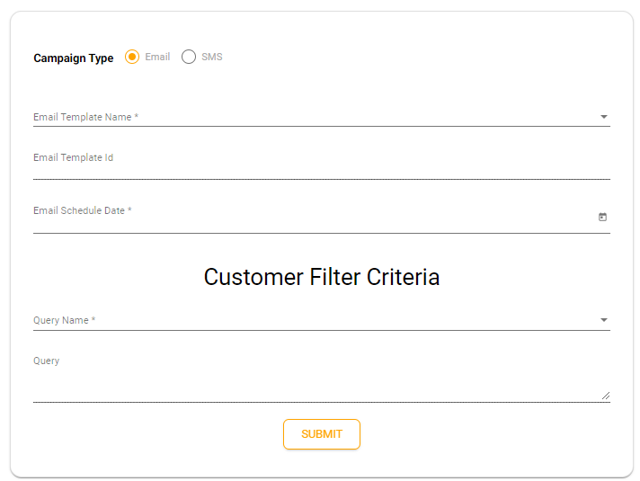
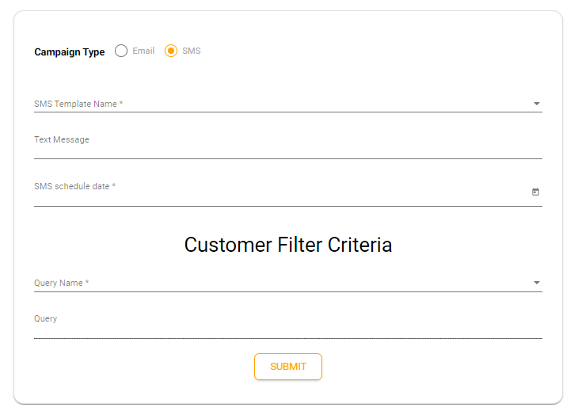

# Scheduler

The **Scheduler** is helpful when you might be in the situation where you just want to send bulk Email or SMS to specific group of users then this gonna be really helpful.

In short we have two way of interaction under Scheduler:
<ul>
<li>E-mail</li>
<li>SMS</li>
</ul>

<ol>
<h3><li>Email</li></h3>
  <ul>
    <li>
    Select the Email Template you want to send
    </li>
    <li>
    Choose the date when you want to fire this campaign
    </li>
    <li>
    Select the Query Name to select who are your targeted users.
    </li>
    <li>
    Submit
    </li>

  </ul>

  

  <h3><li>SMS</li></h3>
<ul>
    <li>
    Select the SMS Template you want to send
    </li>
    <li>
    Choose the date when you want to fire this campaign
    </li>
    <li>
    Select the Query Name to select who are your targeted users.
    </li>
    <li>
    Submit
    </li>

  </ul>
</ol>

